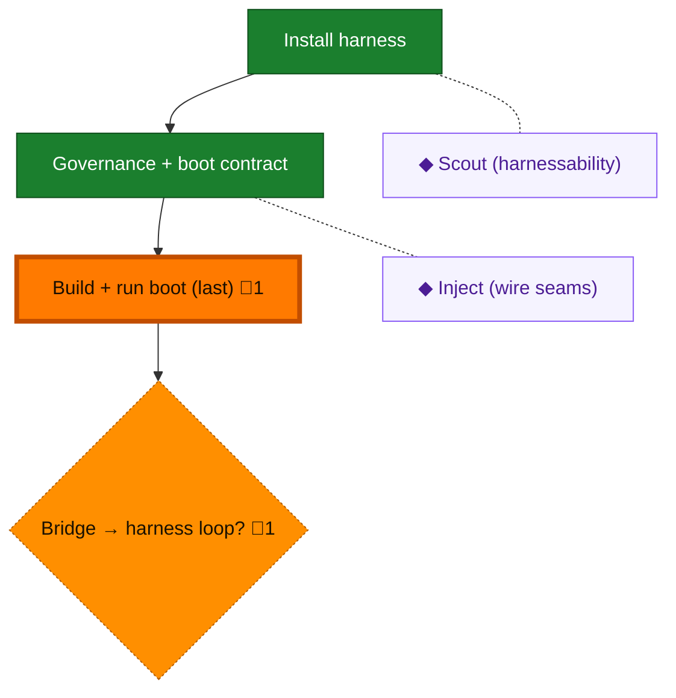

<!-- GENERATED by `harness flow render` — do not hand-edit; regenerate from the flow JSON. -->
# Flow · onboarding

**Kind**: harness-adopt · **Now**: build-boot · **Next**: bridge · **Intent**: Harness installed; real checks and boot return unconfigured because no product lane exists · **Nodes**: 6 · **Events**: 13

**Rail**: ◆─[ ◆ ]─✗─✗  ◆ Install harness · [ ◆ Governance + boot contract ] · ✗ Build + run boot (last) · ✗ Bridge → harness loop?

**Legend** — colour = type/status: 🟩 done · 🟢 in-progress · 🟥 blocked · 🟦 known · ⬜ assumed · 🔶 decision · 🗣 user input · 🟪 harness chore (faded = not yet done) · 🤖 companion · 🛠 worker · 🟧 current (you are here). Badges: 💬 comments · 📄 artifacts · 📝 instructions · 🧰 chore (° optional / recommended / ‼ strongly-recommended; ✓ done · ✕ skipped).

## Node log

### build-boot · Build + run boot (last)
- `2026-09-07T00:38:28.702Z` · agent · validation — Real harness checks and boot returned unconfigured, exit 2. Two extensions loaded, zero conventions; five harness-only composition tests pass. Canonical product lane absent; no product readiness claimed.

### bridge · Bridge → harness loop?
- `2026-09-07T00:38:29.022Z` · agent · validation — Onboarding artifacts are installed. Do not enter the operational product loop until a canonical product build/test/startup or smoke lane is implemented and actually verified.

### scout · Scout (harnessability)
- `2026-09-07T00:38:52.251Z` · agent · validation — Independent pre-product baseline assessment generated at .harness/reports/harnessability/latest.json; authoritative v0.2 schema validates and latest mirrors equal run artifacts. No product execution claimed.
