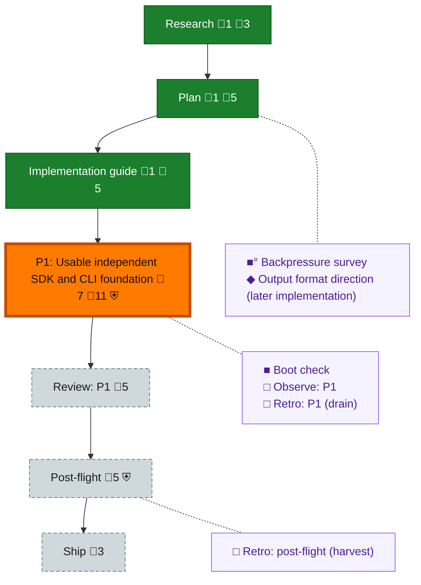

<!-- GENERATED by `harness flow render` — do not hand-edit; regenerate from the flow JSON. -->
# Flow · sdk-cli-foundation

**Kind**: flight-plan · **Now**: phase-1 · **Intent**: Collect requirements and research for Unisphere base Rust SDK, thin CLI, architecture and tests; requirements-spine.md is not an approved plan; dogfood Builder and report to pij-varied-alpaca · **Nodes**: 13 · **Events**: 26

**Rail**: ◆─◆─◆─[ ◐─◇ ]─◇─◇  ◆ Research · ◆ Plan · ◆ Implementation guide · [ ◐ P1: Usable independent SDK and CLI foundation · ◇ Review: P1 ] · ◇ Post-flight · ◇ Ship

**Legend** — colour = type/status: 🟩 done · 🟢 in-progress · 🟥 blocked · 🟦 known · ⬜ assumed · 🔶 decision · 🗣 user input · 🟪 harness chore (faded = not yet done) · 🤖 companion · 🛠 worker · 🟧 current (you are here). Badges: 💬 comments · 📄 artifacts · 📝 instructions · 🧰 chore (° optional / recommended / ‼ strongly-recommended; ✓ done · ✕ skipped) · ⛨ dd gate (terminal/total from the last evaluation; ✓ = open). ⛨✓/⛨✕ = a plan-validate check gate (green / not green).

## Node log

### research · Research
- `2026-09-07T04:55:47.490Z` · agent · validation — Historical reconciliation: approved product plan and guide consumed assets/requirements/flowspace3-interview.md, assets/research/otel-common-format.md and research context recorded in plan.dd.json. Guide handoff accepted at 5865a38566904989c384726761f2a4e503e47b7f; no product execution claim.

### plan · Plan
- `2026-09-07T04:56:07.708Z` · agent · validation — Historical product-plan reconciliation: current plan hash bc208a54522fe9d5d26c87d25270806ad72b6b0a53d9155ae4cff1b2871fe3cc; approved inputs in assets/pm-handoff.md. Current harness plan validate reports zero issues/orphans; all product completion claims remain unchecked.

### impl-guide · Implementation guide
- `2026-09-07T04:56:27.507Z` · agent · validation — Approved independent decomposition r2: subject d325a8f60a3c97739b7c3b16e612110b5db84530; guide sha256 95da8bf6c3d65077ae18085a379c9c4f780571a7f2ef62d5ac1a65644ae6cdb0; canonical receipt assets/team/review-decomposition-review-decomposition-d325a8f-pij-angry-hekarro-r2.dd.json. Five tasks/twenty assertions authored, 11 ACs accounted, schema/view/plan checks zero issues. Baseline source remains unimplemented.

### phase-1 · P1: Usable independent SDK and CLI foundation
- `2026-09-07T04:55:15.019Z` · user · decision — Jordan answered 'yep' to Plan001 implementation scope, relayed by pij-female-varl. PM pij-right-kotallo authorized tasks/flow, real shared baseline, three gated full-clone Astra/high lanes, composition/proof and independent Opus/high reviews; local commits/evidence and dogfood reporting. No push/PR/main merge/destructive cleanup/global changes/private telemetry. Full scope: assets/implementation-authorization.json.
- `2026-09-07T05:17:32.264Z` · agent · validation — Baseline R1 approved label was refused E475 due to two open medium findings; report preserved. Corrected baseline/guide v4 committed 633b9bf3c533188bde44e49a9d88f56a9b572bfd; guide hash 370eaee98d6122eb2581b158ca606236b3318db66d7b694ac16273746c4a3d9e. 13 scoped tests, clippy incl tests and fmt pass in assets/baseline-r2-final-checks.json. Independent focused r2 pending; no seal/dispatch release.
- `2026-09-07T05:32:58.748Z` · agent · warning — Actual baseline seal succeeded: source8eafef5,17 frozen files,vd-0001 3+10 tests, independent approved r3. Evidence commit6c3d2920. All3 baseline-only units refused ready E471: Dependencies lack committed proof: tk-0001; next action asks composition receipt proof before lanes. Exact envelopes assets/baseline-ready-refusal.json. Escalated to pij-varied-alpaca; no fabricated composition, manual dispatch or global change.
- `2026-09-07T06:11:24.160Z` · agent · warning — Owner-directed HOLD at fixedHEAD1ec7213488044ba083da3db7f45a958024a86c86. Guidev7/r6 independently approved; actual18-file baseline-v7 sealed (13 tests) and tk0002/tk0003/tk0005 ready all passed. Allthree nativeclone dispatches then refused E470: Unit allocation requires its live parent, canonical plan, unit and recorded base. Source-confirmed Builder row46: acts/builder.ts:257 provision pass-through and dispatch-service.ts:1029-1038 omit parent AllocationRecord; allocation-store.ts:489-503 requires it. Original live parent allocation al-001-4437fdce-9332-4eed-9398-7651d0ab20e2 remains intact. Exact evidence assets/dispatch-allocation-refusal.json; r6review/seal/ready/dispatch-refusal records retained on disk UNCOMMITTED. Runtime owner pij-varied-alpaca owns correction after PR198; pij-female-varl directs hold. No further guide changes, reviews, retries, manual allocations, source resets, commits or global changes while prerequisite is unchanged. Resume only after owner-confirmed corrected supported runtime: actualready -&gt; native dispatch -&gt; prework ack/release -&gt; fresh post-release confirmation -&gt; verified deliveries/composition/review. Keep all11 productACs unclaimed. Notify pij-female-varl when runtime availability changes.
- `2026-09-07T07:05:32.019Z` · agent · note — Runtime prerequisite changed: pij-varied-alpaca reports authorized merges PR198 cd533bb4 and PR19945ac8b2b98e550852f2250809ac80872629c1762, ff-only shared-main update and just build; harness0.14.0 and builderhelp smoke passed, both fixes in dist. These build/smoke actions are owner-reported, not PM-executed dispatch proof. Resume existing gates at unchanged source1ec72134/v7 basis; retain old refusals and hold no new source/guide review. Actualready/dispatch/ack/release outcomes will decide progress.
- `2026-09-07T07:33:29.913Z` · agent · decision — PM implementation clarifications accepted by oversight: (D1) SDK may declare existing serde.workspace and use serde visitors alongside core/serde_json; this corrects an overly narrow third-party import list, not a new package, shared API/fence or outward dependency, and avoids a custom JSON grammar. (D2) SDK facade reexports existing core ConfigReader, InspectionApi, ReadFailure and MAX_CONFIG_BYTES alongside DTO/error types so an SDK-only external consumer can inject a reader. (D3) F8 toolchain checks compare all release versions and available emitted commit identities; missing formatter commit metadata is an explicit warning/provenance gap, not a false match or sole failure. Missing executable, mismatch or failed probe still fails. Active packet/guide bytes remain frozen for binding; these narrow corrections are explicit inputs to docs, architecture allowlist and independent composition review. No baseline ceremony repeated and no new proof grade.
- `2026-09-07T07:35:12.027Z` · agent · validation — Corrected runtime45ac8b2b yielded three actual dispatches exit0/statusok at07:06:32Z: tk0002 pij-partial-koi, tk0003 pij-standard-impala, tk0005 pij-brave-cahir, distinct fullclones, configured/observed OMP github-copilot/gpt-6-astra high. Allthree native prework acknowledgements accepted; releases issued with IDs7ae4d03c-a61d-4bde-92e3-fdea4c8a8374 /9e5b4b55-68c0-4972-89e2-603f34f4dadc /ee6d46f0-2efb-4db8-ae2c-b2f69818d9dd. Allthree fresh post-release acknowledgements accepted by Builder, release.outcome delivered. Evidence dispatch-fixed-tk-000{2,3,5}.json and postrelease-ack-tk-000{2,3,5}.json. Row46 exercised end-to-end; row45 live case used HEAD==sealed source1ec72134, descendant branch remains unit-test evidence only. Native startup .serena metadata preserved and excluded only through clone-local .git/info/exclude (owner-supported row47); no frozen/global/source change. SDK cdcb1d69 passed24tests+2rustdoc; CLI initial2f3a1169 failed mutable-writer lifetime compilation, corrected49654b0a passed18tests. These are isolated lane checks, not composition acceptance. Allallocation gates completed before this evidence commit; source snapshots and prior failures preserved.

### backpressure · Backpressure survey
- `2026-09-07T04:56:07.433Z` · agent · validation — Inline /eng-harness-flow --hook pre-coding --json per AGENTS skill fallback. decision:redirect actual_stage:add-extension missing_rung:S4-build-and-run-boot verdict:UNAVAILABLE; observed harness boot --json exit 2 at 2026-09-07T04:52:18.232Z. Existing assets/backpressure.dd.json selects BUILD/EXTEND for all eleven ACs, with bp-0008 independent source judgement; real checks/boot extension work belongs to authorized tk-0005 and composed proof, not fake onboarding success. basis_sha256:bc208a54522fe9d5d26c87d25270806ad72b6b0a53d9155ae4cff1b2871fe3cc time:2026-09-07T04:55:14.891037+00:00

### boot-1 · Boot check
- `2026-09-07T04:56:57.388Z` · agent · validation — Inline /eng-harness-flow --hook pre-flight --json per AGENTS skill fallback; decision:redirect actual_stage:add-extension missing_rung:S4-build-and-run-boot verdict:UNAVAILABLE. Real harness boot --json exit 2 at 2026-09-07T04:56:57.261Z; product proof absent, authorized tk-0005 will wire the real foundation lane. Baseline uses its scoped Rust check; no boot-success claim.
