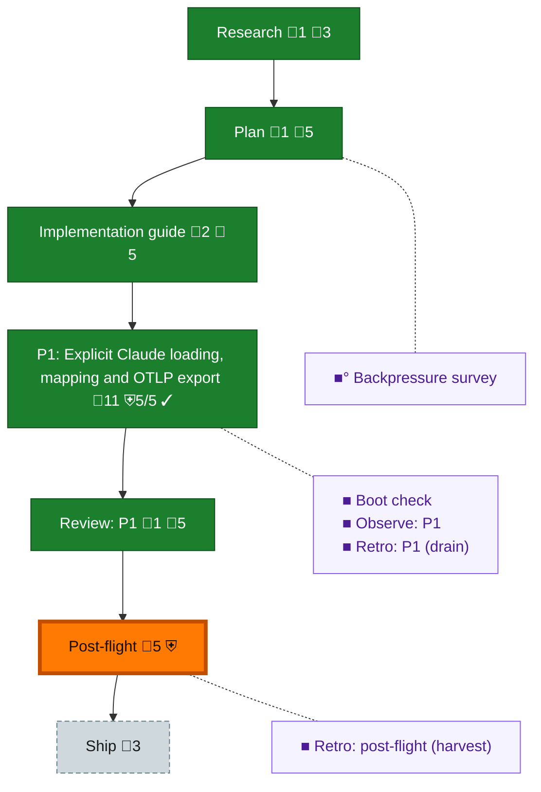

<!-- GENERATED by `harness flow render` — do not hand-edit; regenerate from the flow JSON. -->
# Flow · claude-session-pipeline

**Kind**: flight-plan · **Now**: post-flight · **Intent**: Jordan approved pure Claude adapter with noI/O, sharedfakeable SessionLoader list_sessions/read_batch and standardOTLPJSONLoutput; freshworktree/newagents, PMplan/guide then independentreview andimplementation, archivebeforeauthorizedlanding. · **Nodes**: 12 · **Events**: 30

**Rail**: ◆─◆─◆─[ ◆─◆ ]─◐─◇  ◆ Research · ◆ Plan · ◆ Implementation guide · [ ◆ P1: Explicit Claude loading, mapping and OTLP export · ◆ Review: P1 ] · ◐ Post-flight · ◇ Ship

**Legend** — colour = type/status: 🟩 done · 🟢 in-progress · 🟥 blocked · 🟦 known · ⬜ assumed · 🔶 decision · 🗣 user input · 🟪 harness chore (faded = not yet done) · 🤖 companion · 🛠 worker · 🟧 current (you are here). Badges: 💬 comments · 📄 artifacts · 📝 instructions · 🧰 chore (° optional / recommended / ‼ strongly-recommended; ✓ done · ✕ skipped) · ⛨ dd gate (terminal/total from the last evaluation; ✓ = open). ⛨✓/⛨✕ = a plan-validate check gate (green / not green).

## Node log

### research · Research
- `2026-09-08T00:48:39.692Z` · agent · validation — Designinputs recorded in assets/design-inputs.md: archivedstandard-firstworkshop, sanitizedscratchClaude/framingcontracts andprimaryOTLPJSONencoding. Scouts failedNoModelSelected before results; PMboundedresearch completedinline. No private stores or newproductproof claimed.

### plan · Plan
- `2026-09-08T00:48:40.760Z` · agent · validation — Productplan authored/validated with12observableACs, noerrors/warnings, futuretasks/ACsunchecked; exactcommitted plan/guide21a9f987 now under freshindependentOpusreview.

### impl-guide · Implementation guide
- `2026-09-08T01:03:16.137Z` · agent · validation — Independent r1 changes-requested at21a9f987 preserved canonically. Guidev2 corrections006600d8 address F1–F12 with corecollectionport, recoverablelimits, Unixscope, closedprofile/pins/outputcap/purityinstrument; F13 accepted with actualbaselinecompile obligation. Current plan/guide structuralDD0issues, no productcode/proof yet. Focused independent amended-contract reread underway.
- `2026-09-08T01:42:59.119Z` · agent · validation — Independent design r2 approved006600d8 with0openfindings and currentplan/guide digests; sourceboundbaselineconformance is implementation substep, not another productdesign gate. Realsharedbaseline20tests and actualarchitecturegreen recorded; no concrete3lane implementationproof yet.

### review-1 · Review: P1
- `2026-09-08T03:39:03.869Z` · agent · validation — Independent composition approval rv-plan005-composition-opus-r2 accepted at03:29:52Z for actual artifact093a89811296efb681386047b1da912348c63f10. Zero open findings, four accepted advisories with rationale. Canonical receipt and report retained; no repeated product proof.

### backpressure · Backpressure survey
- `2026-09-08T00:48:40.497Z` · agent · validation — eng-harness-flow pre-coding followed inline: scoped12AC survey selects actualBUILD/EXTEND instruments in assets/backpressure.dd.json, linkedbyDDwriters; inheritedbootpassedconfigurationfoundationonly, newcollectionproof absent untilimplementation. basis_sha256:ff6bcc7faa386dc47145da1f678afeef48b4c4b2e9af5bcf0783d91988a3218b time:2026-09-08T00:48:39.420406+00:00

### boot-1 · Boot check
- `2026-09-08T01:43:00.196Z` · agent · validation — eng-harness-flow pre-flight followed inline: actual inheritedboot at00:39:28Z exited0/readytrue configurationfoundationonly; newbaseline20tests/actualarchitecture checks recorded separately, no newcollectionboot falsely claimed. Current product proof will be extended duringimplementation.

### observe-1 · Observe: P1
- `2026-09-08T03:25:39.870Z` · agent · validation — Actual captures retained in assets/observations-pij-right-kotallo-plan005.json and assets/observations-pij-right-kotallo.json; committed PM retro records at98bb1cdd34e7b65233c7db5cf755f7ec420c832d. Worker custody is preserved in assets/observation-custody.json; no worker bucket was cleared. time:2026-09-08T03:25:39.632Z

### retro-1 · Retro: P1 (drain)
- `2026-09-08T03:25:40.160Z` · agent · validation — eng-harness-flow --hook post-coding followed inline per repo AGENTS: installed CLI/loaded extensions and existing governance plus actual candidate boot support the loop; two PM buckets were read, saved via harness record retro, committed with verified attribution at98bb1cdd, then only those own buckets cleared. Records .harness/records/retro/2026-09-08/001-plan005-delivery.md and002-plan005-review-intake.md. No new product proof or successful telemetry flush implied. time:2026-09-08T03:25:40.015Z

### retro-harvest · Retro: post-flight (harvest)
- `2026-09-08T03:39:04.834Z` · agent · validation — eng-harness-flow --hook post-flight followed inline per repo AGENTS after actual phase drain: harness retro insights --plan005-claude-session-pipeline returned2records/2entries/malformed0 (assets/retro-harvest.json). Highest leverage classification defect fixed upstreamPR204 and original review intake now passed; receipt-schema validation before handoff is the named next encoding offer in assets/post-flight.md. Explicit local telemetry lookups returnedE100/ref_unavailable; no global-absence or flush claim and no remote sync under HARNESS_NO_TELEMETRY_AUTOSYNC=1. time:2026-09-08T03:39:04.699Z
