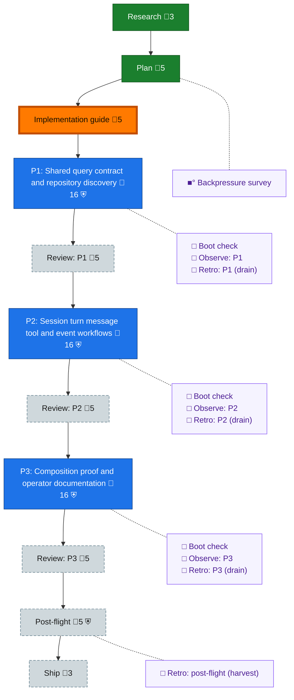

<!-- GENERATED by `harness flow render` — do not hand-edit; regenerate from the flow JSON. -->
# Flow · session-query-cli

**Kind**: flight-plan · **Now**: impl-guide · **Nodes**: 22 · **Events**: 19

**Rail**: ◆─◆─◇─[ ◇─◇─◇─◇─◇─◇ ]─◇─◇  ◆ Research · ◆ Plan · ◇ Implementation guide · [ ◇ P1: Shared query contract and repository discovery · ◇ Review: P1 · ◇ P2: Session turn message tool and event workflows · ◇ Review: P2 · ◇ P3: Composition proof and operator documentation · ◇ Review: P3 ] · ◇ Post-flight · ◇ Ship

**Legend** — colour = type/status: 🟩 done · 🟢 in-progress · 🟥 blocked · 🟦 known · ⬜ assumed · 🔶 decision · 🗣 user input · 🟪 harness chore (faded = not yet done) · 🤖 companion · 🛠 worker · 🟧 current (you are here). Badges: 💬 comments · 📄 artifacts · 📝 instructions · 🧰 chore (° optional / recommended / ‼ strongly-recommended; ✓ done · ✕ skipped) · ⛨ dd gate (terminal/total from the last evaluation; ✓ = open). ⛨✓/⛨✕ = a plan-validate check gate (green / not green).

## Node log

### backpressure · Backpressure survey
- `2026-09-10T04:47:25.930Z` · agent · validation — decision:run result:survey-updated; inline /eng-harness-flow --hook pre-coding followed the supplied router and backpressure module. Current 24-criterion proof selection retained; new query-service/CLI behaviors remain BUILD/EXTEND, not proven. Canonical backpressure DD validation and generated-view consistency both passed. basis_sha256:23e11ee7ec867315349aab8df11282da08bf211a6c86e27a3782292ba5bcecef time:2026-09-10T04:47:25.657Z
