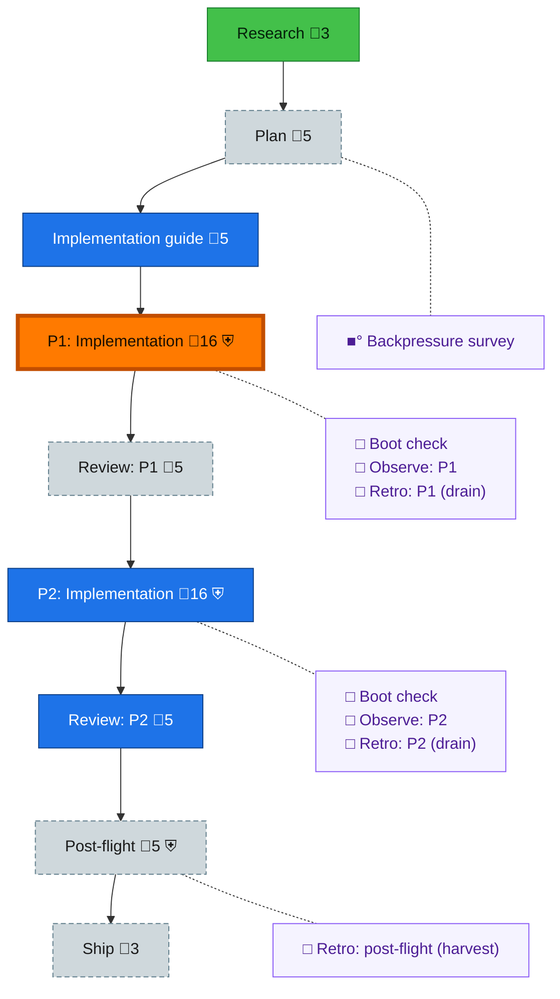

<!-- GENERATED by `harness flow render` — do not hand-edit; regenerate from the flow JSON. -->
# Flow · prep-canonical-tables

**Kind**: flight-plan · **Now**: phase-1 · **Nodes**: 17 · **Events**: 12

**Rail**: ◐─◇─◇─[ ◇─◇─◇─◇ ]─◇─◇  ◐ Research · ◇ Plan · ◇ Implementation guide · [ ◇ P1: Implementation · ◇ Review: P1 · ◇ P2: Implementation · ◇ Review: P2 ] · ◇ Post-flight · ◇ Ship

**Legend** — colour = type/status: 🟩 done · 🟢 in-progress · 🟥 blocked · 🟦 known · ⬜ assumed · 🔶 decision · 🗣 user input · 🟪 harness chore (faded = not yet done) · 🤖 companion · 🛠 worker · 🟧 current (you are here). Badges: 💬 comments · 📄 artifacts · 📝 instructions · 🧰 chore (° optional / recommended / ‼ strongly-recommended; ✓ done · ✕ skipped) · ⛨ dd gate (terminal/total from the last evaluation; ✓ = open). ⛨✓/⛨✕ = a plan-validate check gate (green / not green).

## Node log

### backpressure · Backpressure survey
- `2026-09-29T04:31:49.080Z` · agent · validation — decision:route hook:pre-coding verb:backpressure (skill://eng-harness-flow references/stages/backpressure.md executed) result:assets/backpressure.dd.json 15 rows (EXISTS 2, EXTEND 5, BUILD 8, ABSENT 0), 8 sensors, certainty Partial; AC pressure links written basis_sha256:e1872f2cc578e37b275fad3b3057c05b38ed9f7e719de360696c32bbcf5d6f86 time:2026-09-29T04:31:48Z
