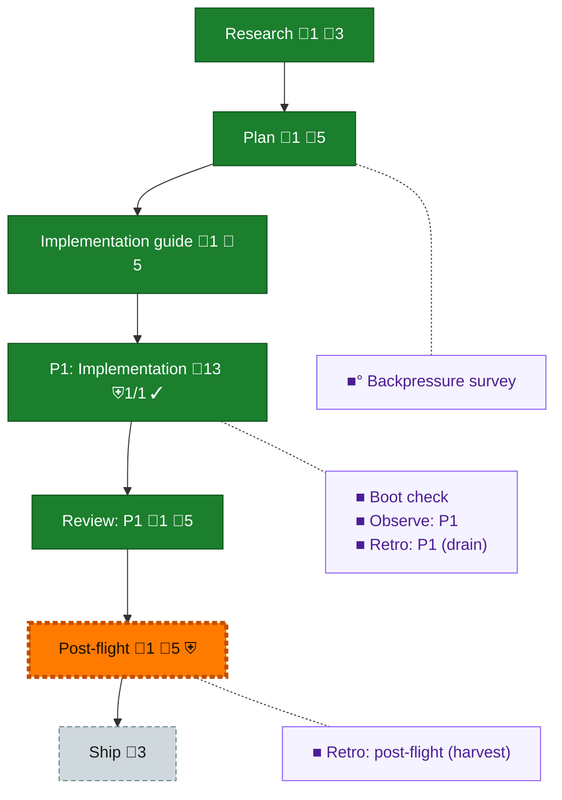

<!-- GENERATED by `harness flow render` — do not hand-edit; regenerate from the flow JSON. -->
# Flow · adapter-catalog

**Kind**: flight-plan · **Now**: post-flight · **Nodes**: 12 · **Events**: 27

**Rail**: ◆─◆─◆─[ ◆─◆ ]─◇─◇  ◆ Research · ◆ Plan · ◆ Implementation guide · [ ◆ P1: Implementation · ◆ Review: P1 ] · ◇ Post-flight · ◇ Ship

**Legend** — colour = type/status: 🟩 done · 🟢 in-progress · 🟥 blocked · 🟦 known · ⬜ assumed · 🔶 decision · 🗣 user input · 🟪 harness chore (faded = not yet done) · 🤖 companion · 🛠 worker · 🟧 current (you are here). Badges: 💬 comments · 📄 artifacts · 📝 instructions · 🧰 chore (° optional / recommended / ‼ strongly-recommended; ✓ done · ✕ skipped) · ⛨ dd gate (terminal/total from the last evaluation; ✓ = open). ⛨✓/⛨✕ = a plan-validate check gate (green / not green).

## Node log

### research · Research
- `2026-09-08T04:35:35.751Z` · agent · validation — Existing app registry, output conventions, core serialization and fidelity constraints inspected; Main supplemental request provides bounded catalog intent. No six-adapter implementation authorized. time:2026-09-08T04:35:35.553Z

### plan · Plan
- `2026-09-08T04:35:36.021Z` · agent · validation — Six observable catalog ACs authored and validated with zero errors/warnings at the committed design; no implementation proof claimed by planning. time:2026-09-08T04:35:35.892Z

### impl-guide · Implementation guide
- `2026-09-08T04:35:36.295Z` · agent · validation — Independent design R2 rv-plan009-design-opus-r2 approved09c0605f; D1-D5 fixed, accepted stream-compatibility note retained. Core baseline sealed with actual declared check; no coder fan-out needed. time:2026-09-08T04:35:36.162Z

### review-1 · Review: P1
- `2026-09-08T06:23:38.756Z` · agent · validation — Independent composition R1 approved17829db8, canonical intake succeeded; six ACs met with two accepted advisories and exact real proof, no repeated review.

### post-flight · Post-flight
- `2026-09-08T06:24:25.221Z` · agent · builder-preservation — /Users/jordanknight/substrate/unisphere/unisphere-plan009-preserved/cc7339c5-4bf1-4d56-96fe-b22f948d6242/receipt/preservation.dd.json

### backpressure · Backpressure survey
- `2026-09-08T04:35:36.568Z` · agent · validation — eng-harness-flow pre-coding followed inline per repo guidance: six selected proof rows, named real-binary adapter_catalog target and production provenance gate. Current basis_sha256:b5cfc5fb5d3d590589607010f963b522acd34b2c77154a08aabbebc0d24d68d8 time:2026-09-08T04:35:36.439Z

### boot-1 · Boot check
- `2026-09-08T04:35:36.841Z` · agent · validation — eng-harness-flow pre-flight followed inline: inherited product boot proof remains Plan005 candidate093a8981; local sealed core baseline executed in this worktree, and the new catalog actual CLI smoke is recorded separately. No full pre-change boot rerun in this worktree is claimed. time:2026-09-08T04:35:36.709Z

### observe-1 · Observe: P1
- `2026-09-08T06:23:37.056Z` · agent · validation — Actual observation captured and retained in assets/observation-custody.json, committed .harness/records/retro/2026-09-08/003-plan009-catalog.md; only own bucket cleared. time:2026-09-08T06:23:36.928Z

### retro-1 · Retro: P1 (drain)
- `2026-09-08T06:23:37.321Z` · agent · validation — eng-harness-flow --hook post-coding followed inline: actual own-bucket drain retained/committed at2c128db5 then cleared; malformed-free block YAML. Product proof not rerun. time:2026-09-08T06:23:37.196Z

### retro-harvest · Retro: post-flight (harvest)
- `2026-09-08T06:23:37.586Z` · agent · validation — eng-harness-flow --hook post-flight followed inline: actual harness retro insights result retained in assets/retro-harvest.json. Naming zero-coder receipt initialization as upstream encoding opportunity; no remote sync under command-local HARNESS_NO_TELEMETRY_AUTOSYNC=1. Local telemetry E100/ref_unavailable retained, not global absence. time:2026-09-08T06:23:37.461Z
