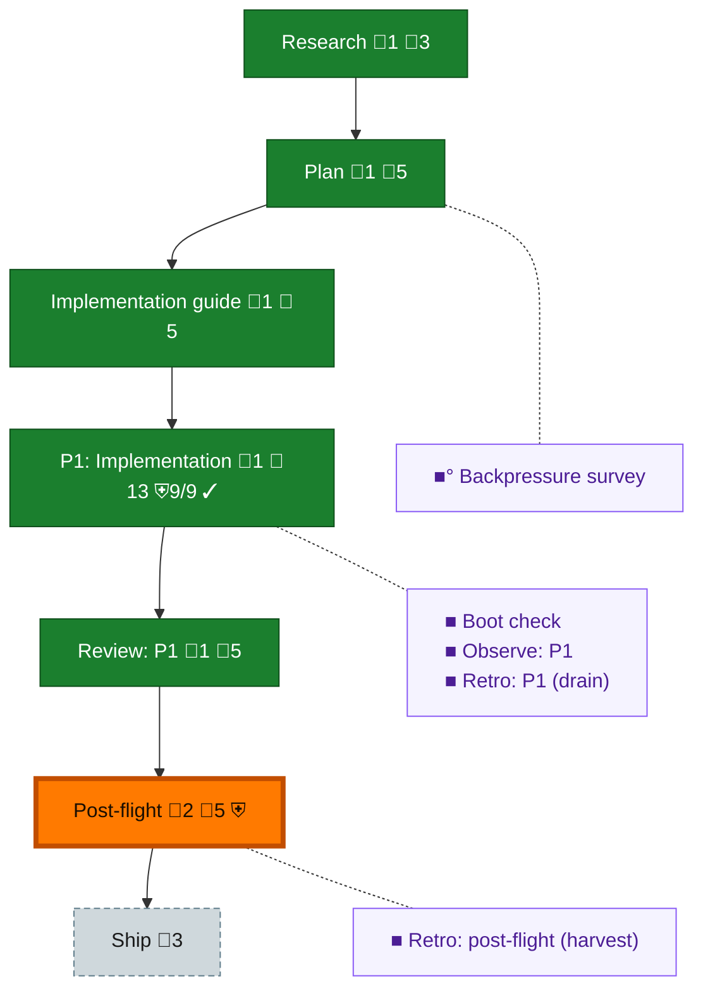

<!-- GENERATED by `harness flow render` — do not hand-edit; regenerate from the flow JSON. -->
# Flow · native-adapters

**Kind**: flight-plan · **Now**: post-flight · **Nodes**: 12 · **Events**: 30

**Rail**: ◆─◆─◆─[ ◆─◆ ]─◆─◇  ◆ Research · ◆ Plan · ◆ Implementation guide · [ ◆ P1: Implementation · ◆ Review: P1 ] · ◆ Post-flight · ◇ Ship

**Legend** — colour = type/status: 🟩 done · 🟢 in-progress · 🟥 blocked · 🟦 known · ⬜ assumed · 🔶 decision · 🗣 user input · 🟪 harness chore (faded = not yet done) · 🤖 companion · 🛠 worker · 🟧 current (you are here). Badges: 💬 comments · 📄 artifacts · 📝 instructions · 🧰 chore (° optional / recommended / ‼ strongly-recommended; ✓ done · ✕ skipped) · ⛨ dd gate (terminal/total from the last evaluation; ✓ = open). ⛨✓/⛨✕ = a plan-validate check gate (green / not green).

## Node log

### research · Research
- `2026-09-08T22:33:58.721Z` · agent · validation — Existing native structural dossier and pinned source facts were completed before coding; immutable artifacts in assets/native-structural-research.json, vscode-journal-schema.json and cursor-snapshot-schema.json. No private payload fixture export. recorded:2026-09-08T22:33:58.484Z

### plan · Plan
- `2026-09-08T22:33:59.025Z` · agent · validation — Ten product acceptance criteria and the standing six-adapter authorization are retained in plan.dd.json and assets/operator-authorization.json. Product completion evidence is linked; no new ingestion scope. recorded:2026-09-08T22:33:58.879Z

### impl-guide · Implementation guide
- `2026-09-08T22:33:59.603Z` · agent · validation — Independent R1/R2 decomposition review completed; genuine R2 approved all7 independent lanes at3a635c17 and baseline sealed. Historical-source verifier now observes original Git tree; source-correction evidence and original receipts retained. recorded:2026-09-08T22:33:59.463Z

### phase-1 · P1: Implementation
- `2026-09-08T22:34:02.736Z` · agent · validation — All original native deliveries are now bound by genuine dispatch/packet records and no-replay historical integration114e1535. Formal current artifact6a38efaf proof records vd0002/3/4 exit0. Product code equals independent-reviewedc6f3636b; existing approval binding successor pending, no implementation replay.

### review-1 · Review: P1
- `2026-09-08T22:38:14.220Z` · agent · validation — Actual canonical R2 composition binding intake succeeded for formalartifact6a38efaf, same product bytes as approvedc6. Original R1 review immutable; no repeated source review. Canonical receipt373d7d54 and formal composition70fee1b2 retained.

### post-flight · Post-flight
- `2026-09-08T22:38:25.739Z` · agent · builder-preservation — /Users/jordanknight/substrate/unisphere/unisphere-plan010-formal-preserved/f098aad7-0985-4645-a1f5-9c6d425ce129/receipt/preservation.dd.json
- `2026-09-08T22:39:18.016Z` · agent · validation — Actual Builder close archived Plan010 with genuine external PreservationReceipt f098aad7 (3261e103). Archived strict plan completion returned0errors0warnings0open. Productc6/formalartifact6a unchanged; all8workspaces retained, no retirement. Final archive evidence committed before preservation refresh.

### backpressure · Backpressure survey
- `2026-09-08T22:33:59.315Z` · agent · validation — eng-harness-flow pre-coding followed inline on reconciliation: current canonical backpressure rows resolve to actual retained native/quality/boot evidence, not planned commands. Product intent unchanged; factual acceptance is Proven. basis_sha256:2160c94a738ec3cb49c482d8099c4a86ee5dfe36b545ffdaaedd106693eab3ac recorded:2026-09-08T22:33:59.180Z

### boot-1 · Boot check
- `2026-09-08T22:33:59.904Z` · agent · validation — eng-harness-flow pre-flight reconciliation followed inline: original contract smoke and exact product boot results retained; first formal composition now records current artifact6a38efaf with native boot/checks success. This comment does not invent a new before-coding execution. recorded:2026-09-08T22:33:59.755Z

### observe-1 · Observe: P1
- `2026-09-08T22:34:00.193Z` · agent · validation — Actual nine observations were retained in six durable retro records. Worker source/custody records and owner-only clear receipts remain in assets; no other peer bucket cleared by PM. recorded:2026-09-08T22:34:00.056Z

### retro-1 · Retro: P1 (drain)
- `2026-09-08T22:34:00.476Z` · agent · validation — eng-harness-flow post-coding followed inline: own bucket is empty after its committed retention; actual harvest returned6records/9entries/malformed0, saved in assets/formal-closeout-harvest.json. No repeated product proof needed for this drain. recorded:2026-09-08T22:34:00.340Z

### retro-harvest · Retro: post-flight (harvest)
- `2026-09-08T22:38:15.438Z` · agent · validation — eng-harness-flow post-flight followed inline: actual formal-closeout harvest6records9entries/malformed0, own observation bucket empty, original worker custody retained. Upstream PR206/207 encode the observed native-binding/historical-integration lesson. Local telemetry lookup E100/ref_unavailable retained; no remote sync claim under HARNESS_NO_TELEMETRY_AUTOSYNC=1.
