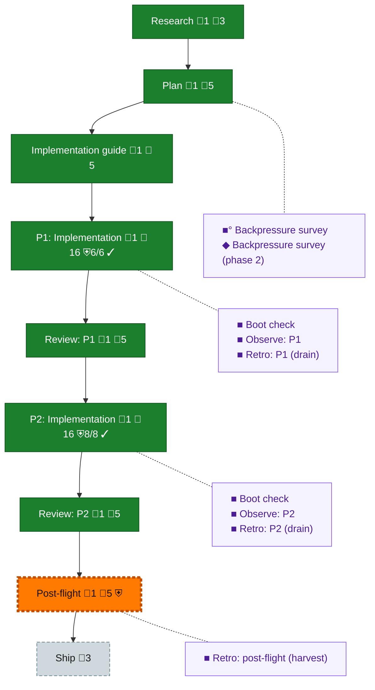

<!-- GENERATED by `harness flow render` — do not hand-edit; regenerate from the flow JSON. -->
# Flow · prep-canonical-tables

**Kind**: flight-plan · **Now**: post-flight · **Nodes**: 18 · **Events**: 48

**Rail**: ◆─◆─◆─[ ◆─◆─◆─◆ ]─◇─◇  ◆ Research · ◆ Plan · ◆ Implementation guide · [ ◆ P1: Implementation · ◆ Review: P1 · ◆ P2: Implementation · ◆ Review: P2 ] · ◇ Post-flight · ◇ Ship

**Legend** — colour = type/status: 🟩 done · 🟢 in-progress · 🟥 blocked · 🟦 known · ⬜ assumed · 🔶 decision · 🗣 user input · 🟪 harness chore (faded = not yet done) · 🤖 companion · 🛠 worker · 🟧 current (you are here). Badges: 💬 comments · 📄 artifacts · 📝 instructions · 🧰 chore (° optional / recommended / ‼ strongly-recommended; ✓ done · ✕ skipped) · ⛨ dd gate (terminal/total from the last evaluation; ✓ = open). ⛨✓/⛨✕ = a plan-validate check gate (green / not green).

## Node log

### research · Research
- `2026-09-29T10:07:20.290Z` · agent · validation — complete: research inputs recorded in plan research_context and original-ask.md; product plan 75f7ffb time:2026-09-29T10:07:20Z

### plan · Plan
- `2026-09-29T10:07:20.600Z` · agent · validation — complete: product plan plan.dd.json (13 ACs, 2 phases), backpressure survey time:2026-09-29T10:07:20Z

### impl-guide · Implementation guide
- `2026-09-29T10:07:20.914Z` · agent · validation — complete: implementation guide v3 (dfb8bf8 delta), decomposition reviews rv-028-decomposition-r2 and -p2-r2 approved, baselines sealed 3f39e1b and cfd716b time:2026-09-29T10:07:20Z

### phase-1 · P1: Implementation
- `2026-09-29T10:07:21.227Z` · agent · validation — complete: phase-1 composition verified d800949 (vd-0008, vd-0015); tasks/phase-1 all checked time:2026-09-29T10:07:20Z

### review-1 · Review: P1
- `2026-09-29T07:15:50.190Z` · agent · note — Phase-1 composition review approved (rv-028-composition-p1-r1). Guide v3 sealed for phase 2 (baseline-p2, f82d7b5); builder advance to phase-2 is refused until the phase-2 composition verifies against baseline-p2 (tooling: gate compares the current baseline). Phase-2 dispatch proceeds from review-1; nav advances once compose --verify passes. 2026-09-29T07:15:50Z

### post-flight · Post-flight
- `2026-09-29T10:07:52.207Z` · agent · builder-preservation — /Users/jordanknight/substrate/unisphere/preserved/028-prep-canonical-tables/0f070327-02f9-4ff4-b536-a601e110033c/receipt/preservation.dd.json

### backpressure · Backpressure survey
- `2026-09-29T04:31:49.080Z` · agent · validation — decision:route hook:pre-coding verb:backpressure (skill://eng-harness-flow references/stages/backpressure.md executed) result:assets/backpressure.dd.json 15 rows (EXISTS 2, EXTEND 5, BUILD 8, ABSENT 0), 8 sensors, certainty Partial; AC pressure links written basis_sha256:e1872f2cc578e37b275fad3b3057c05b38ed9f7e719de360696c32bbcf5d6f86 time:2026-09-29T04:31:48Z

### boot-1 · Boot check
- `2026-09-29T05:07:39.483Z` · agent · validation — decision:route hook:pre-flight phase:ph-ed41 verb:boot (skill://eng-harness-flow references/stages/boot.md) ran 'harness boot --json' at 1a46a86 (sealed baseline 3f39e1b + records): status ok, ready:true, scope configuration-native-sessions-and-git-notes; verdict SLOW (all stages pass, boot well over 45s: checks + 6 proof modes); prep has no boot proof mode yet (tk-0006 adds it). time:2026-09-29T05:07:39Z

### observe-1 · Observe: P1
- `2026-09-29T07:04:27.918Z` · agent · validation — decision:done captures: harness observe DL-001 (builder compose one-roster-per-baseline), DL-002 (plan worktree lacks local ddocs), DL-003 (dispatch --bin omp refused by pij-rs; shim), DL-004 (machine load 128-193; flaky git_query under load), WIN-001 (deterministic prep proofs); drained to .harness/records/retro/2026-09-29/001-028-prep-canonical-tables-phase-1.md time:2026-09-29T07:04:27Z

### retro-1 · Retro: P1 (drain)
- `2026-09-29T07:04:28.294Z` · agent · validation — decision:route hook:post-coding verb:retro --drain (skill://eng-harness-flow references/stages/retro.md) bucket pij-native-tick: 5 entries saved all (disposition kept) to .harness/records/retro/2026-09-29/001-028-prep-canonical-tables-phase-1.md, bucket cleared; harness-itself entries DL-001 and DL-003 offered as upstream issues to the operator via the prime; highest value DL-003. time:2026-09-29T07:04:27Z

### retro-harvest · Retro: post-flight (harvest)
- `2026-09-29T10:03:24.023Z` · agent · validation — decision:route hook:post-flight verb:retro --harvest + improve (skill .pi/skills/eng-harness-flow references/stages/retro.md, followed inline) harness retro insights --plan 028-prep-canonical-tables --json: 2 records, 15 entries, 15 open, buffer_pending 0, malformed 0; top cluster [difficulty/harness-itself] 9 open (proof_gap true); lifecycle unchanged (no marks). Improve offer: highest leverage = per-phase baselines/composition receipts in Builder (DL-001/DL-003 cluster), held for the operator's upstream-issue decision via the prime; repo-local encoding offered = run the numbers-only real-corpus coverage/measure scripts at lane delivery (DL-009). Closeout note assets/post-flight.md. time:2026-09-29T10:03:23Z

### phase-2 · P2: Implementation
- `2026-09-29T10:07:21.537Z` · agent · validation — complete: phase-2 composition verified 19ace79 (vd-0008, vd-0015; receipt 9a09aab); tasks/phase-2 all checked time:2026-09-29T10:07:20Z

### review-2 · Review: P2
- `2026-09-29T10:07:21.854Z` · agent · validation — complete: rv-028-composition-p2-r1 approved 19ace79, 0 findings (pij-panicky-anteater, claude-sonnet-5.5) time:2026-09-29T10:07:20Z

### boot-2 · Boot check
- `2026-09-29T07:27:45.761Z` · agent · validation — decision:route hook:pre-flight phase:ph-62fe verb:boot ran 'harness boot --json' at 311f337/cfd716b lineage (phase-2 sealed baseline + records): status ok, ready:true, proofs composition, sdk-consumer, installed-cli, collection, native, git-notes, prep all passed; verdict SLOW (well over 45 s under load avg ~100). time:2026-09-29T07:27:37Z

### observe-2 · Observe: P2
- `2026-09-29T09:59:38.913Z` · agent · validation — decision:done captures: harness observe DL-001..DL-007 in bucket pij-native-tick (advance gate across re-seal, dispatch readiness E471, second-phase import E472, guide drift beyond meta.updated, on-track directory prefixes, receipt custody, phase receipt plan drift) plus coder buckets (tk-0007/tk-000a/tk-000d on-track, tk-000b packet map); drained to .harness/records/retro/2026-09-29/002-028-prep-canonical-tables-phase-2.md time:2026-09-29T09:59:38Z

### retro-2 · Retro: P2 (drain)
- `2026-09-29T09:59:39.237Z` · agent · validation — decision:route hook:post-coding verb:retro --drain (skill://eng-harness-flow references/stages/retro.md) bucket pij-native-tick: 10 entries saved all (disposition kept: 7 harness-itself, 2 plan, 1 win) to .harness/records/retro/2026-09-29/002-028-prep-canonical-tables-phase-2.md, bucket cleared; harness-itself entries held for the operator's upstream-issue decision via the prime; highest value DL-001/DL-003 (per-phase baselines and receipts). time:2026-09-29T09:59:38Z

### backpressure-7da3d4a4d059 · Backpressure survey (phase 2)
- `2026-09-29T07:09:00.719Z` · agent · validation — decision:route hook:pre-coding verb:backpressure (re-survey for guide v3 / phase 2; plan bytes changed only by phase-1 progress/proof links) result:assets/backpressure.dd.json bp-0006 proof now includes vd-0017 coverage, bp-0009 probe records the DuckDB install; 11 rows checked with receipts from phase 1; certainty Confident basis_sha256:7da3d4a4d05949ddba02368c80dbe145189a63214c43bd0335c381e36ce64e46 time:2026-09-29T07:09:00Z
